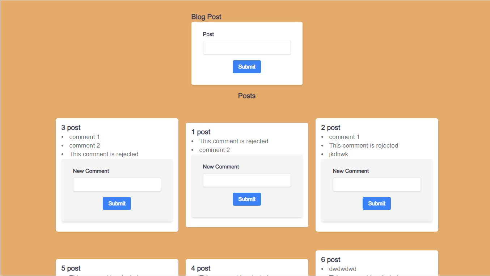

# MiniMicroservicesBlog

A mini microservice blog project using 4 node js service nextjs frontend app

service
1, Post -[Create Post, List all Posts]

2, Comments -[Create a Comment ,List all Comments]

3,client

4, event-bus

5, moderation

6, query

setup 
frontend React app
backend post and comment service

# POST SERVICE
/post(post,{title:string})
/post{get}

# COMMENTS SERVICE 
/post/:id/comments{post,{content:string}}

/post/:id/comment{get}

1 problem -many request
solution 1,sync communcation 2, aysnc communcation (event Broker and add Query service)

# Dockerizing 
steps{ from,workdir,copy run, copy,CMD}
commands
docker build -t yohannes543/posts:0.0.1---build image
docker run[image]----start a container
docker run -it[image][cmd]----override
docker ps----print out information
docker exec -it[container id][cmd]    
docker logs[container id]

# kubernetes
steps{kubernetes cluster,node,pod ,deployment ,service }
commands
kubectl apply -f posts.yaml
kubectl get pods ----print out info
kubectl exec -it[pod_name]
kubectl logs{pod_name}
kubectl delete pod [pod_name] 
kubectl describe pod [pod_name]
kubectl apply -f[config file name]

# create a kubernetes Deployments
commands
kubectl apply -f deployment.yml
kubectl get deployment
kubectl describe deployment [depl name]
kubectl delete deployment [depl_name]

# create a kubernetes service
type{cluster ip,node port, load balancer ,external Name}

# add new service
1, build an image for the service
2, push the image to docker hub
3, create a deployment for service
4, create a cluster ip service for  services